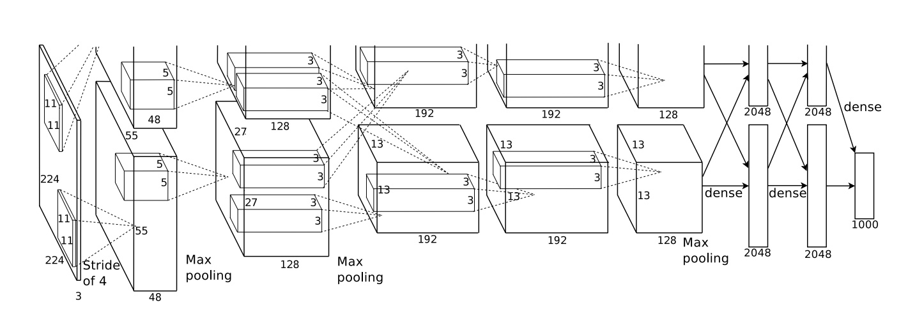
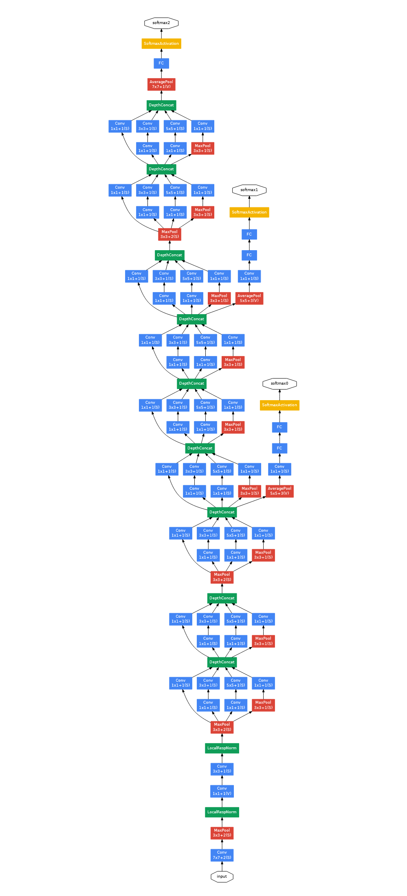
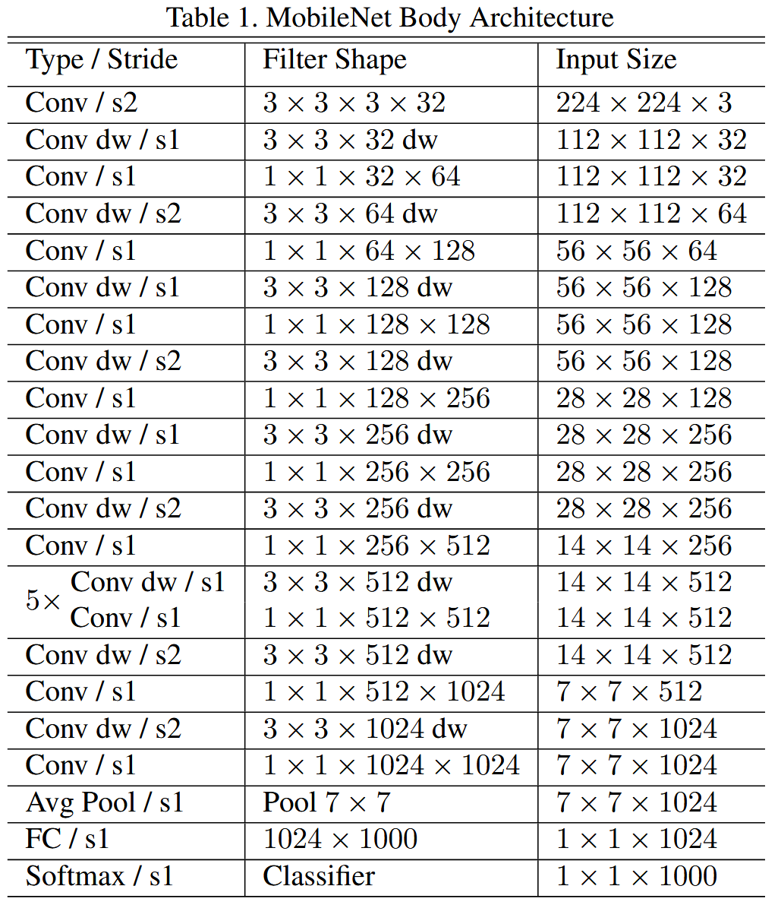
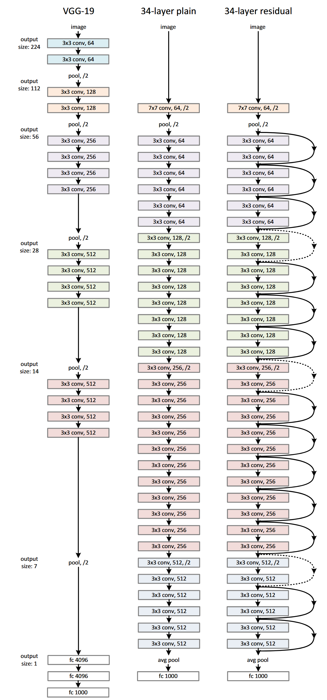
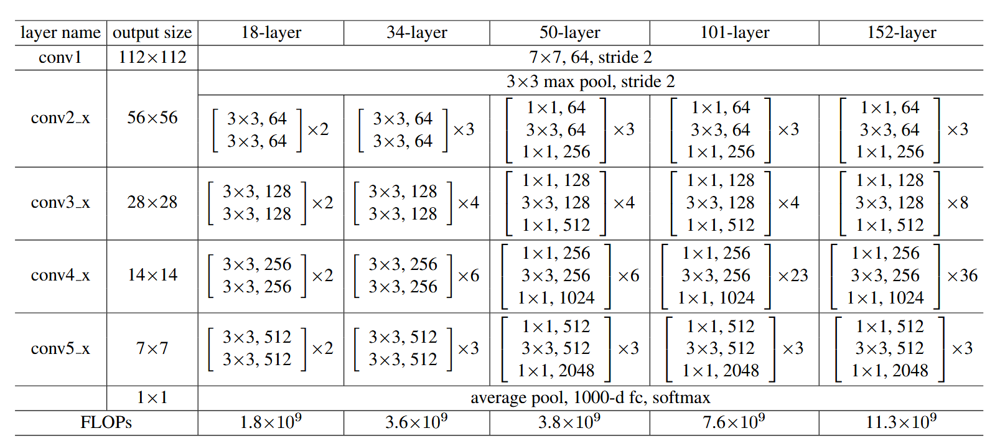
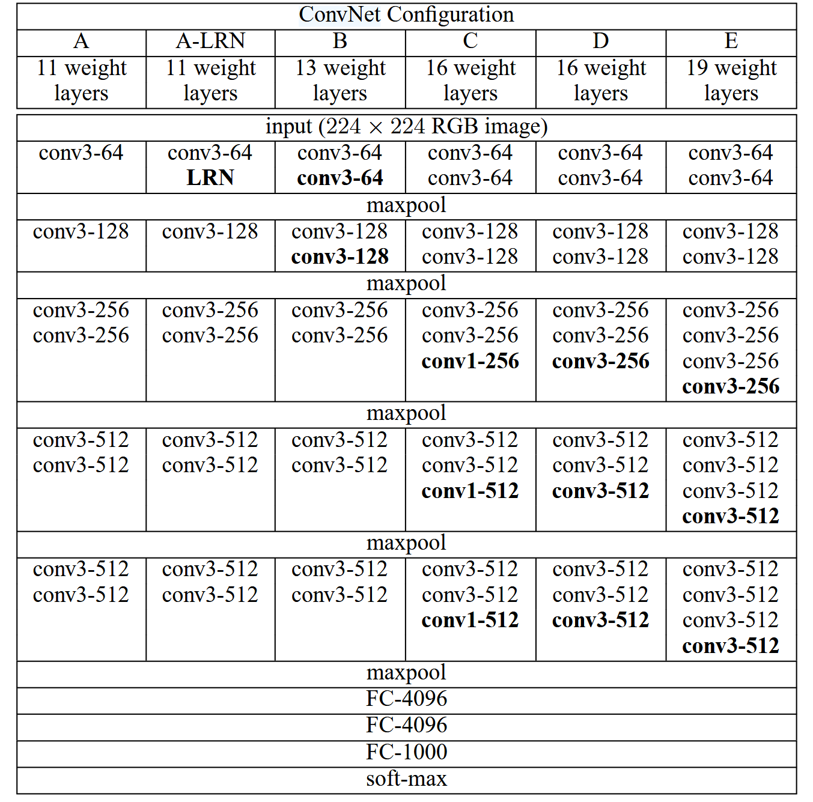
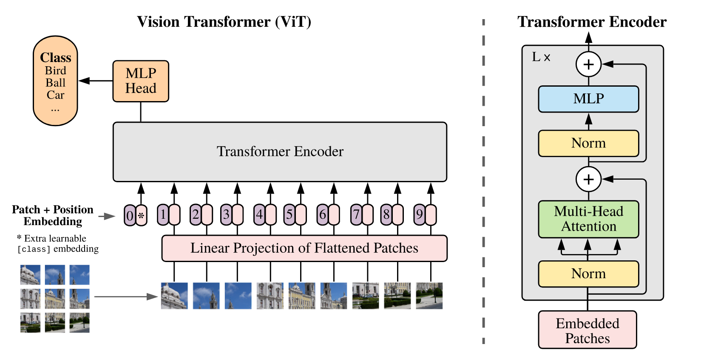
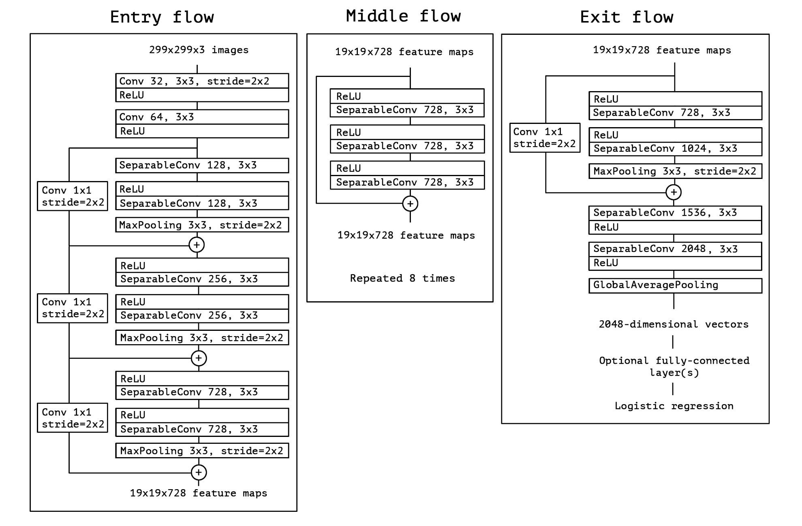

# Classification in PyTorch

Here I implement a series of classification networks in PyTorch for fun, and I train and test the networks on CIFAR-10 and CIFAR-100 dataset. For simplicity, I don't use complex training tricks and use nearly same hyper parameters and training method to train the networks.

## Dataset

The dataset for training and testing is CIFAR, which can be directly obtained from https://www.cs.toronto.edu/~kriz/cifar.html. The following is the dataset description copied from the website.

**CIFAR-10**.

The CIFAR-10 dataset consists of **60000** 32x32 colour images in **10 classes**, with **6000 images per class**. There are **50000 training images and 10000 test images**. The dataset is divided into five training batches and one test batch, each with 10000 images. The test batch contains exactly 1000 randomly-selected images from each class. The training batches contain the remaining images in random order, but some training batches may contain more images from one class than another. Between them, the training batches contain exactly 5000 images from each class.

Here are the classes in the dataset, as well as 10 random images from each:

**CIFAR-100**.

This dataset is just like the CIFAR-10, except it has **100 classes** containing 600 images each. There are 500 training images and 100 testing images per class. The 100 classes in the CIFAR-100 are grouped into 20 superclasses. Each image comes with a "fine" label (the class to which it belongs) and a "coarse" label (the superclass to which it belongs).
Here is the list of classes in the CIFAR-100:

| Superclass                     | Classes                                               |
| ------------------------------ | ----------------------------------------------------- |
| aquatic mammals                | beaver, dolphin, otter, seal, whale                   |
| fish                           | aquarium fish, flatfish, ray, shark, trout            |
| flowers                        | orchids, poppies, roses, sunflowers, tulips           |
| food containers                | bottles, bowls, cans, cups, plates                    |
| fruit and vegetables           | apples, mushrooms, oranges, pears, sweet peppers      |
| household electrical devices   | clock, computer keyboard, lamp, telephone, television |
| household furniture            | bed, chair, couch, table, wardrobe                    |
| insects                        | bee, beetle, butterfly, caterpillar, cockroach        |
| large carnivores               | bear, leopard, lion, tiger, wolf                      |
| large man-made outdoor things  | bridge, castle, house, road, skyscraper               |
| large natural outdoor scenes   | cloud, forest, mountain, plain, sea                   |
| large omnivores and herbivores | camel, cattle, chimpanzee, elephant, kangaroo         |
| medium-sized mammals           | fox, porcupine, possum, raccoon, skunk                |
| non-insect invertebrates       | crab, lobster, snail, spider, worm                    |
| people                         | baby, boy, girl, man, woman                           |
| reptiles                       | crocodile, dinosaur, lizard, snake, turtle            |
| small mammals                  | hamster, mouse, rabbit, shrew, squirrel               |
| trees                          | maple, oak, palm, pine, willow                        |
| vehicles 1                     | bicycle, bus, motorcycle, pickup truck, train         |
| vehicles 2                     | lawn-mower, rocket, streetcar, tank, tractor          |

## Training Details

**Dataset.**

I split the training dataset into training and validation sets, while the training dataset has 45k images, and validation dataset has 5k images. I follow the simple data augmentation in ResNet: input images are padded with 4 pixels on each side, then a 32x32 is randomly sampled from the padded image or its horizontal flip, finally normalized with per-pixel mean and standard deviation. For validation or testing, input images are just normalized with per-pixel mean and standard deviation.

**Training.**

I use a base learning rate of 0.1, weight decay of 0.0005, and momentum of 0.9. The models will be trained with a mini-batch size of 256 on a single Nvidia RTX 4090 GPU for 200 epochs. Besides, learning rate will be divided by 10 when the validation error plateus. During training, the checkpoints of the best model with highest validation accuracy will be saved for testing. After training, the model will be validated on testing dataset, and Top-1 Accuracy and Top-5 Accuracy will be reported.

## Implementations

### AlexNet

*ImageNet Classification with Deep Convolutional Neural Networks*

#### Authors

Alex Krizhevsky, Ilya Sutskever, Geoffrey E. Hinton

#### Abstract

We trained a large, deep convolutional neural network to classify the 1.3 million high-resolution images in the LSVRC-2010 ImageNet training set into the 1000 different classes. On the test data, we achieved top-1 and top-5 error rates of 39.7% and 18.9% which is considerably better than the previous state-of-the-art results. The neural network, which has 60 million parameters and 500,000 neurons, consists of five convolutional layers, some of which are followed by max-pooling layers, and two globally connected layers with a final 1000-way softmax. To make training faster, we used non-saturating neurons and a very efficient GPU implementation of convolutional nets. To reduce overfitting in the globally connected layers we employed a new regularization method that proved to be very effective.

[[Paper]](https://papers.nips.cc/paper_files/paper/2012/file/c399862d3b9d6b76c8436e924a68c45b-Paper.pdf)[[Code]](./models/alexnet.py)

Since the GTX 580 GPU has only 3GB of memory, a single GPU could not store the entire AlexNet. The implementation here is a simplified version of the original.

    <b>AlexNet Architecture</b>

### GoogLeNet

*Going deeper with convolutions*

#### Authors

Christian Szegedy, Wei Liu, Yangqing Jia, Pierre Sermanet, Scott Reed, Dragomir Anguelov, Dumitru Erhan, Vincent Vanhoucke, Andrew Rabinovich

#### Abstract

We propose a deep convolutional neural network architecture codenamed Inception, which was responsible for setting the new state of the art for classification and detection in the ImageNet Large-Scale Visual Recognition Challenge 2014 (ILSVRC14). The main hallmark of this architecture is the improved utilization of the computing resources inside the network. This was achieved by a carefully crafted design that allows for increasing the depth and width of the network while keeping the computational budget constant. To optimize quality, the architectural decisions were based on the Hebbian principle and the intuition of multi-scale processing. One particular incarnation used in our submission for ILSVRC14 is called GoogLeNet, a 22 layers deep network, the quality of which is assessed in the context of classification and detection.

[[Paper]](http://arxiv.org/abs/1409.4842)[[Code]](./models/googlenet.py)

    <b>GoogLeNet Architecture</b>

### MobileNetV1

*MobileNets: Efficient Convolutional Neural Networks for Mobile Vision  Applications*

#### Authors

Andrew G. Howard, Menglong Zhu, Bo Chen, Dmitry Kalenichenko, Weijun Wang, Tobias Weyand, Marco Andreetto, Hartwig Adam

#### Abstract

We present a class of efficient models called MobileNets for mobile and embedded vision applications. MobileNets are based on a streamlined architecture that uses depthwise separable convolutions to build light weight deep neural networks. We introduce two simple global hyperparameters that efficiently trade off between latency and accuracy. These hyper-parameters allow the model builder to choose the right sized model for their application based on the constraints of the problem. We present extensive experiments on resource and accuracy tradeoffs and show strong performance compared to other popular models on ImageNet classification. We then demonstrate the effectiveness of MobileNets across a wide range of applications and use cases including object detection, finegrain classification, face attributes and large scale geo-localization.

[[Paper]](http://arxiv.org/abs/1704.04861)[[Code]](./models/mobilenetv1.py)

    <b>MobileNetV1 Architecture</b>

### ResNet

*Deep Residual Learning for Image Recognition*

#### Authors

Kaiming He, Xiangyu Zhang, Shaoqing Ren, Jian Sun

#### Abstract

Deeper neural networks are more difficult to train. We present a residual learning framework to ease the training of networks that are substantially deeper than those used previously. We explicitly reformulate the layers as learning residual functions with reference to the layer inputs, instead of learning unreferenced functions. We provide comprehensive empirical evidence showing that these residual networks are easier to optimize, and can gain accuracy from considerably increased depth. On the ImageNet dataset we evaluate residual nets with a depth of up to 152 layers—8× deeper than VGG nets [41] but still having lower complexity. An ensemble of these residual nets achieves 3.57% error on the ImageNet test set. This result won the 1st place on the ILSVRC 2015 classification task. We also present analysis on CIFAR-10 with 100 and 1000 layers. The depth of representations is of central importance for many visual recognition tasks. Solely due to our extremely deep representations, we obtain a 28% relative improvement on the COCO object detection dataset. Deep residual nets are foundations of our submissions to ILSVRC & COCO 2015 competitions1, where we also won the 1st places on the tasks of ImageNet detection, ImageNet localization, COCO detection, and COCO segmentation.

[[Paper]](http://arxiv.org/abs/1512.03385)[[Code]](./models/resnet.py)

    <b>Model Architecture Comparison</b>

    <b>ResNet Variants</b>

### VGGNet

*Very Deep Convolutional Networks for Large-Scale Image Recognition*

#### Authors

Karen Simonyan, Andrew Zisserman

#### Abstract

In this work we investigate the effect of the convolutional network depth on its accuracy in the large-scale image recognition setting. Our main contribution is a thorough evaluation of networks of increasing depth using an architecture with very small (3 × 3) convolution filters, which shows that a significant improvement on the prior-art configurations can be achieved by pushing the depth to 16–19 weight layers. These findings were the basis of our ImageNet Challenge 2014 submission, where our team secured the first and the second places in the localisation and classification tracks respectively. We also show that our representations generalise well to other datasets, where they achieve state-of-the-art results. We have made our two best-performing ConvNet models publicly available to facilitate further research on the use of deep visual representations in computer vision.

[[Paper]](http://arxiv.org/abs/1409.1556)[[Code]](./models/vgg.py)

    <b>VGGNet Variants</b>

### ViT

*An Image is Worth 16x16 Words: Transformers for Image Recognition at Scale*

#### Authors

Alexey Dosovitskiy, Lucas Beyer, Alexander Kolesnikov, Dirk Weissenborn, Xiaohua Zhai, Thomas Unterthiner, Mostafa Dehghani, Matthias Minderer, Georg Heigold, Sylvain Gelly, Jakob Uszkoreit, Neil Houlsby

#### Abstract

While the Transformer architecture has become the de-facto standard for natural language processing tasks, its applications to computer vision remain limited. In vision, attention is either applied in conjunction with convolutional networks, or used to replace certain components of convolutional networks while keeping their overall structure in place. We show that this reliance on CNNs is not necessary and a pure transformer applied directly to sequences of image patches can perform very well on image classification tasks. When pre-trained on large amounts of data and transferred to multiple mid-sized or small image recognition benchmarks (ImageNet, CIFAR-100, VTAB, etc.), Vision Transformer (ViT) attains excellent results compared to state-of-the-art convolutional networks while requiring substantially fewer computational resources to train.

[[Paper]](http://arxiv.org/abs/2010.11929)[[Code]](./models/vit.py)

The code is based on the full PyTorch [[implementation]](https://github.com/lucidrains/vit-pytorch/blob/main/vit_pytorch/vit.py) for ViT and [[implementation]](https://github.com/hyunwoongko/transformer) for Transformer.

### Xception

*Xception: Deep Learning with Depthwise Separable Convolutions*

#### Authors

Francois Chollet

#### Abstract

We present an interpretation of Inception modules in convolutional neural networks as being an intermediate step in-between regular convolution and the depthwise separable convolution operation (a depthwise convolution followed by a pointwise convolution). In this light, a depthwise separable convolution can be understood as an Inception module with a maximally large number of towers. This observation leads us to propose a novel deep convolutional neural network architecture inspired by Inception, where Inception modules have been replaced with depthwise separable convolutions. We show that this architecture, dubbed Xception, slightly outperforms Inception V3 on the ImageNet dataset (which Inception V3 was designed for), and significantly outperforms Inception V3 on a larger image classification dataset comprising 350 million images and 17,000 classes. Since the Xception architecture has the same number of parameters as Inception V3, the performance gains are not due to increased capacity but rather to a more efficient use of model parameters.

[[Paper]](http://arxiv.org/abs/1610.02357)[[Code]](./models/xception.py)

    <b>Xception Architecture</b>

